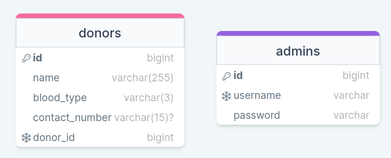
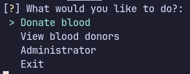
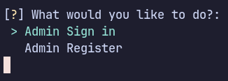
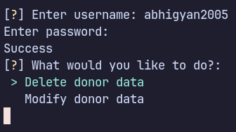

# Blood Bank Management System

## Technology Used
- [Python](https://www.python.org/): Language used for project.
- [Rich](https://github.com/Textualize/rich): Library for beautiful formatting in the terminal.
- [Inquirer](https://github.com/magmax/python-inquirer): A collection of common interactive command line user interfaces, based on [Inquirer.js](https://github.com/SBoudrias/Inquirer.js/)
- [MariaDB](https://mariadb.org)/[MySQL](https://www.mysql.com/): SQL database used in the project.
- [MySQL Python Connector](https://pypi.org/project/mysql-connector-python/): MySQL driver written in Python which does not depend on MySQL C client libraries and implements the DB API v2.0 specification (PEP-249).

## Database
| During Submission | After Submission |
| ----------------- | ---------------- |
|  | 

## Screenshots
### Home


### Donating Blood


### View Modes


### View all donors in list


### View donors by name


### View donors by blood type


### Administrator Home View


### Administrator Tasks View


## How to use
To clone and run this application, you'll need [Git](https://git-scm.com/) and [Python](https://www.python.org/)(which comes with [pip](https://pip.pypa.io/en/stable/)) installed on you machine. From your commandline:
```shell
# Added environment variables for MySQL or MariaDB
$ export mysql-username="<username>"
$ export mysql-password="<password>"

# Clone this repo locally
$ git clone https://github.com/abhigyanmadhukalya/bloodbank

# Go into the repo directory
$ cd bloodbank

# Install dependencies
$ pip install -r requirements.txt

# Run program
$ python app.py
```

## License
MIT

---

> Github: [@abhigyanmadhukalya](https://github.com/abhigyanmadhukalya)
> Mastodon: [@abhigyanmadhukalya](https://mstdn.social/@abhigyanmadhukalya)
